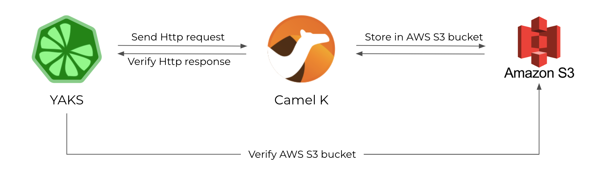

# YAKS AWS S3 Demo

The test shows how to interact with AWS S3 buckets.
The Camel K integration provides a REST API for clients and performs content based routing of incoming requests producing files in different AWS S3 buckets.
The YAKS test invokes the different REST API operations and verifies the AWS S3 files and the HTTP responses.

# Test Scenario



# Run YAKS tests

You can run the test with:

```shell script
$ yaks run test/fruit-service.feature --local
```

When running on Kubernetes/Openshift make sure that you are connected to your namespace on that cluster and run:

```shell script
$ yaks run test/fruit-service.feature
```

Happy testing!
