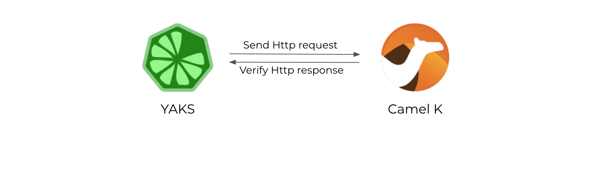

# YAKS OpenAPI Demo

The test uses the OpenAPI specification provided by the System under test to perform contract driven testing.
The Camel K integration provides a REST API for clients.
The YAKS test invokes the different operations and verifies the HTTP responses.

# Test Scenario



# Run YAKS tests

You can run the test with:

```shell script
$ yaks run test/fruit-service.feature --local
```

When running on Kubernetes/Openshift make sure that you are connected to your namespace on that cluster and run:

```shell script
$ yaks run test/fruit-service.feature
```

Happy testing!
