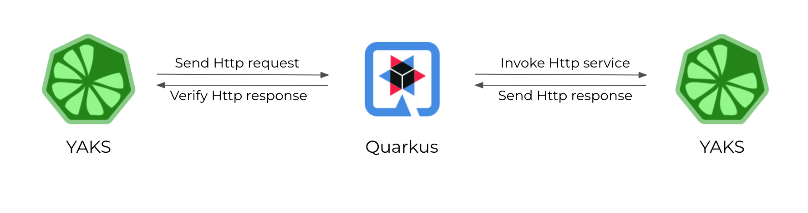

# YAKS Quarkus Demo

The test connects to a Quarkus application and invokes the provided REST OpenAPI endpoint.
The YAKS test invokes the different operations and verifies the HTTP responses.

# Run the Quarkus application

The tests use a Quarkus web application as SUT (System Under Test). We need to start the application first before running any test.

You can run the OpenAPI fruit-store web application as follows:

```shell script
$ mvn quarkus:dev
```                             

This runs the fruit-store service that exposes the Http REST API on `http://localhost:8080`.

# Test Scenario



# Run YAKS tests

Once the Quarkus application is running on your local machine, you can run the tests with:

```shell script
$ yaks run fruit-store/src/test/resources/features --local
```

As an alternative you can run the Cucumber JUnit test 
[org.citrusframework.yaks.fruits.FruitsFeature](fruit-store/src/test/java/org/citrusframework/yaks/fruits/FruitsFeature.java) from your favorite IDE.

This will run all feature files located in [src/test/resources/features](fruit-store/src/test/resources/features).

Happy testing!
